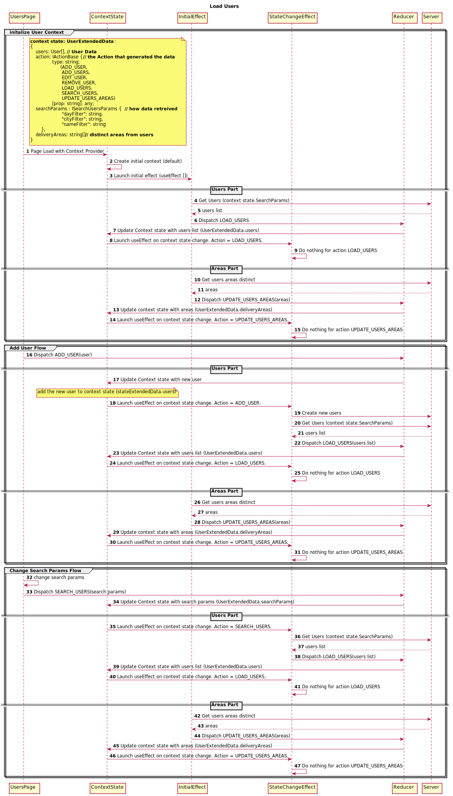

## PORTAL STRUCTURE OVERVIEW ##

### MAIN COMPONENTS ###

The application consists of two main components: Parcels and Users. Each presents its corresponsing   data set: Parcels and Users. But, as Users manages only Users's related data, Parcel also manages the association of user to parcel. 

### CONTEXT API ###
Both data sets (parcels and users) are stored as React Context used as a single point of truth. The application uses reducers to modify the context data that are called using the dispacth mechanism.  An effect is then used to issue the appropriate API call to the server. In case of an error, the effect dispatches a refresh/reload action to the reducer in order to rollback the acrtion.

### SEQUENCE DIAGRAM EXAMPLE FOR USERS CONTEXT ###

   
### ERROR HANDLING ###
A high level error handling document can be found in the 'docs' folder of the server (https://github.com/Haverim-Larefua/haverim-lerefua-server).

In addition, the application defined ErrorBoudary component to popup an error dialog for unhandled React lifecycle errors that may occure during runtime.